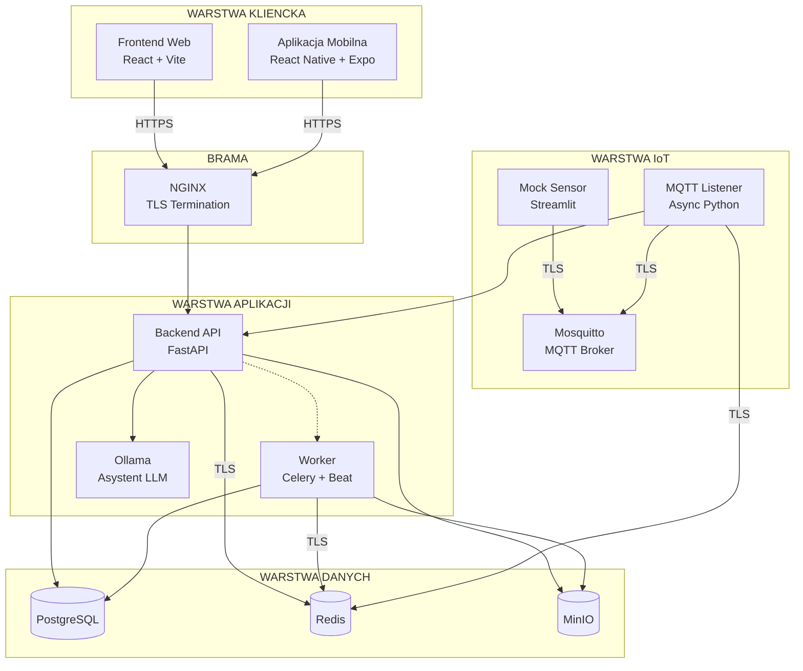

# Opis Rozwiązania — System Magazynowy "Primus Inter Pares 2026"

## Spis Treści

- [1. Wprowadzenie](#1-wprowadzenie)
- [2. Architektura Systemu](#2-architektura-systemu)
  - [2.1 Diagram Komponentów](#21-diagram-komponentów)
  - [2.2 Stos Technologiczny](#22-stos-technologiczny)
- [3. Moduły Systemu](#3-moduły-systemu)
  - [3.1 Backend (FastAPI)](#31-backend-fastapi)
  - [3.2 Worker (Celery)](#32-worker-celery)
  - [3.3 Frontend Web (React + Vite)](#33-frontend-web-react--vite)
  - [3.4 Aplikacja Mobilna (React Native)](#34-aplikacja-mobilna-react-native)
  - [3.5 Warstwa IoT](#35-warstwa-iot)
  - [3.6 Baza Danych i Cache](#36-baza-danych-i-cache)
- [4. Model Danych](#4-model-danych)
- [5. Realizacja Wymagań](#5-realizacja-wymagań)
- [6. Bezpieczeństwo](#6-bezpieczeństwo)
- [7. Wdrożenie i Uruchamianie](#7-wdrożenie-i-uruchamianie)

---

## 1. Wprowadzenie {#1-wprowadzenie}

System zarządzania magazynem "Primus Inter Pares 2026" jest kompleksową platformą do kontroli przestrzeni magazynowej z automatyczną alokacją miejsc, monitorowaniem środowiska w czasie rzeczywistym oraz zaawansowanym systemem raportowania.

### Główne cechy systemu:

| Funkcjonalność | Opis |
|----------------|------|
| **Zarządzanie regałami** | Pełny CRUD z importem CSV |
| **Katalog produktów** | Definicje asortymentu z parametrami przechowywania |
| **Inteligentna alokacja** | Automatyczne dopasowanie miejsca wg wymagań temperaturowych, wagowych i wymiarowych |
| **System FIFO** | Wydawanie towaru zgodnie z kolejnością przyjęcia |
| **Monitorowanie IoT** | Odczyty temperatury i wagi w czasie rzeczywistym |
| **System alertów** | Powiadomienia o przekroczeniach parametrów |
| **Raportowanie PDF** | Generowanie raportów inwentaryzacji i ważności |
| **Backupy szyfrowane** | Harmonogramowane i manualne kopie zapasowe |
| **Rozpoznawanie obrazów** | AI do identyfikacji produktów (YOLO) |
| **Asystent głosowy** | Sterowanie komendami głosowymi (LLM) |

---

## 2. Architektura Systemu {#2-architektura-systemu}

**Typ architektury:** Hybrid Event-Driven Modular Monolith (IoT Ready)

System składa się z 10+ kontenerów Docker, realizujących wszystkie wymagania funkcjonalne i niefunkcjonalne.

### 2.1 Diagram Komponentów {#21-diagram-komponentów}

> Połączenia bez oznaczenia TLS/HTTPS (np. API → PostgreSQL, API → MinIO) zachodzą wyłącznie w izolowanej sieci wewnętrznej Docker i nie są narażone na ruch zewnętrzny.

### 2.2 Stos Technologiczny {#22-stos-technologiczny}

| Warstwa | Technologie |
|---------|-------------|
| **Frontend Web** | React 18, TypeScript, Vite, Tailwind CSS, shadcn/ui |
| **Aplikacja Mobilna** | React Native 0.81, Expo 54, TypeScript, NativeWind (Tailwind) |
| **Backend** | Python 3.12, FastAPI, SQLAlchemy 2.0 (async), Alembic |
| **Worker** | Celery + Celery Beat (harmonogram) |
| **AI/ML** | YOLOv8 (rozpoznawanie obrazów), Ollama (asystent głosowy) |
| **Baza danych** | PostgreSQL 15 |
| **Cache/Broker** | Redis (z TLS) |
| **Storage** | MinIO (bucket: product-images, reports, backups, datasets, models) |
| **IoT** | Eclipse Mosquitto (MQTT z TLS) |
| **Proxy** | NGINX z auto-generowanymi certyfikatami TLS |
| **Kontenery** | Docker Compose |

---

## 3. Moduły Systemu {#3-moduły-systemu}

### 3.1 Backend (FastAPI) {#31-backend-fastapi}

#### Endpointy API (`/api/v1/`):

| Moduł | Lokalizacja | Opis |
|-------|-------------|------|
| **Autentykacja** | [`auth.py`](https://github.com/Primus2026/primus-backend/blob/main/app/api/v1/endpoints/auth.py) | Login, 2FA (TOTP), zarządzanie tokenami JWT |
| **Użytkownicy** | [`users.py`](https://github.com/Primus2026/primus-backend/blob/main/app/api/v1/endpoints/users.py) | CRUD użytkowników, role Admin/Warehouseman |
| **Regały** | [`rack_CRUD.py`](https://github.com/Primus2026/primus-backend/blob/main/app/api/v1/endpoints/rack_CRUD.py) | CRUD regałów, import CSV, wizualizacja |
| **Produkty** | [`product_definition_CRUD.py`](https://github.com/Primus2026/primus-backend/blob/main/app/api/v1/endpoints/product_definition_CRUD.py) | CRUD katalogu produktów, import CSV, upload zdjęć |
| **Przyjęcie towaru** | [`stock_inbound.py`](https://github.com/Primus2026/primus-backend/blob/main/app/api/v1/endpoints/stock_inbound.py) | Skanowanie kodu, alokacja miejsca, potwierdzenie |
| **Wydanie towaru** | [`stock_outbound.py`](https://github.com/Primus2026/primus-backend/blob/main/app/api/v1/endpoints/stock_outbound.py) | FIFO, rezerwacja, potwierdzenie wydania |
| **Alerty** | [`alerts.py`](https://github.com/Primus2026/primus-backend/blob/main/app/api/v1/endpoints/alerts.py) | Lista alertów, oznaczanie jako rozwiązane |
| **Raporty** | [`reports.py`](https://github.com/Primus2026/primus-backend/blob/main/app/api/v1/endpoints/reports.py) | Generowanie i pobieranie raportów PDF |
| **Backupy** | [`backups.py`](https://github.com/Primus2026/primus-backend/blob/main/app/api/v1/endpoints/backups.py) | Tworzenie, listowanie, przywracanie backupów |
| **AI** | [`ai.py`](https://github.com/Primus2026/primus-backend/blob/main/app/api/v1/endpoints/ai.py) | Rozpoznawanie produktów, trening modelu, upload danych |
| **Voice** | [`voice.py`](https://github.com/Primus2026/primus-backend/blob/main/app/api/v1/endpoints/voice.py) | Przetwarzanie komend głosowych |

#### Kluczowe serwisy:

- **AIService** — system rozpoznawania produktów oparty na YOLO (v8/v11):
  - Używa modelu klasyfikacji do identyfikacji asortymentu na podstawie zdjęć. [ai.py](https://github.com/Primus2026/primus-backend/blob/main/app/api/v1/endpoints/ai.py)
  - **Uczenie na podstawie feedbacku**: system gromadzi zdjęcia z błędnych predykcji (feedback użytkownika) w dedykowanym zbiorze danych.
  - **Automatyczny Retrening**: Worker cyklicznie (lub na żądanie) dotrenowuje model na nowych danych, publikuje ulepszone wagi (`best.pt`) i rozsyła sygnał reoladu do wszystkich instancji workera (jeśli w przyszłości będzie ich więcej niż jedna) przez Redis. [ai_tasks.py](https://github.com/Primus2026/primus-backend/blob/main/app/tasks/ai_tasks.py)

- **AllocationService** — inteligentny algorytm alokacji miejsca z uwzględnieniem:
  - Wymagań temperaturowych produktu vs zakres regału
  - Wymiarów produktu vs sloty regału
  - Limitu wagi całkowitej regału
  - Klasy rotacji ABC (produkty A bliżej wyjścia)
  - Implementacja: [allocation_service.py](https://github.com/Primus2026/primus-backend/blob/main/app/services/allocation_service.py)

- **UserService** — zarządzanie tożsamością i dostępem:
  - Obsługa bezpiecznego hashowania haseł i weryfikacji 2FA.
  - Implementacja wieloetapowego procesu rejestracji (wniosek -> weryfikacja -> aktywacja).
  - Implementacja: [user_service.py](https://github.com/Primus2026/primus-backend/blob/main/app/services/user_service.py)

- **BackupService** — tworzenie szyfrowanych backupów (AES/Fernet):
  - Zrzut bazy danych PostgreSQL (`pg_dump`)
  - Archiwizacja plików z MinIO
  - Szyfrowanie i upload do bucketu `backups`
  - Implementacja: [backup_service.py](https://github.com/Primus2026/primus-backend/blob/main/app/services/backup_service.py)

- **VoiceService** — przetwarzanie komend głosowych przez LLM:
  - Parsowanie intencji (dodaj/usuń produkt, generuj raport)
  - Wsparcie dla Ollama (lokalny LLM) lub OpenAI
  - Implementacja: [voice_service.py](https://github.com/Primus2026/primus-backend/blob/main/app/services/voice_service.py)

> Wszystkie serwisy backendowe znajdują się w repozytorium [primus-backend](https://github.com/Primus2026/primus-backend/tree/main/app/services)

#### Proces Zatwierdzania Użytkowników:

System implementuje rygorystyczną politykę bezpieczeństwa dla nowych kont:

1. **Wniosek o rejestrację**: Nowy użytkownik przesyła swoje dane (login, email, hasło) przez punkt `/request_register`.
2. **Status PENDING**: Konto jest tworzone z flagą `is_active=False`. Użytkownik nie może się zalogować.
3. **Powiadomienie Admina**: Administrator widzi listę oczekujących wniosków w panelu zarządzania użytkownikami.
4. **Decyzja Admina**:
   - **Approve**: Konto zostaje aktywowane (`is_active=True`), co umożliwia logowanie i konfigurację 2FA.
   - **Reject**: Dane użytkownika są trwale usuwane z systemu.

### 3.2 Worker (Celery) {#32-worker-celery}

Worker realizuje zadania w tle:

| Zadanie | Plik | Funkcja |
|---------|------|---------|
| **Raporty PDF** | `report_tasks.py` | Generowanie raportów ważności, temperatur, inwentaryzacji |
| **Backupy** | `backup_tasks.py` | Cykliczne tworzenie backupów wg harmonogramu |
| **Import CSV** | `csv_import.py` | Asynchroniczny import dużych plików |
| **AI** | `ai_tasks.py` | Trenowanie modelu YOLO na danych użytkownika oraz predykcja produktów |
| **Statystyki** | `product_stats_tasks.py` | Przeliczanie statystyk rotacji |

**Harmonogram (Celery Beat):**
- Raporty: konfigurowalna godzina (np. 6:00 codziennie)
- Backupy: konfigurowalna godzina (np. 2:00 codziennie)

### 3.3 Frontend Web (React + Vite) {#33-frontend-web-react--vite}

Aplikacja webowa napisana w TypeScript z użyciem nowoczesnych narzędzi:

#### Główne widoki:

| Strona | Opis |
|--------|------|
| **Login** | Formularz logowania z obsługą 2FA |
| **Dashboard (Admin)** | Wizualizacja magazynu — siatka regałów z stanem zapełnienia |
| **Dashboard (Worker)** | Uproszczony widok do skanowania i wydawania |
| **Definicje produktów** | CRUD produktów z uploadem zdjęć |
| **Definicje regałów** | CRUD regałów z importem CSV |
| **Raporty** | Lista i pobieranie wygenerowanych PDF |
| **Backupy** | Tworzenie i przywracanie kopii zapasowych |
| **Użytkownicy** | Zarządzanie kontami (tylko Admin) |
| **Alerty** | Przegląd i zarządzanie alertami |
| **AI Admin** | Panel zarządzania modelem rozpoznawania |
| **Profil** | Zmiana hasła, konfiguracja 2FA |

#### Komponenty:

- **RackCardGrid** — interaktywna wizualizacja regałów (siatka MxN)
- **ImportRacksModal / ImportProductsModal** — upload i podgląd CSV
- **Scanner** — obsługa skanera kodów (kamerka lub ręczne wpisanie)
- **VoiceCommand** — integracja z Web Speech API

### 3.4 Aplikacja Mobilna (React Native) {#34-aplikacja-mobilna-react-native}

Natywna aplikacja mobilna dla magazynierów, zoptymalizowana pod kątem pracy w terenie:

#### Technologie:

| Kategoria | Biblioteka |
|-----------|------------|
| **Framework** | React Native 0.81 + Expo 54 |
| **Routing** | Expo Router (file-based) |
| **Stylowanie** | NativeWind (Tailwind CSS) |
| **HTTP Client** | Axios |
| **State Management** | TanStack React Query |
| **Bezpieczeństwo** | Expo Secure Store (tokeny JWT) |
| **Kamera** | Expo Camera (skanowanie kodów) |
| **Rozpoznawanie mowy** | `@react-native-voice/voice` |

#### Ekrany aplikacji (`app/`):

| Ekran | Ścieżka | Opis |
|-------|---------|------|
| **Login** | `(auth)/` | Logowanie z bezpiecznym przechowywaniem tokena |
| **Home** | `(protected)/home` | Panel główny z przyciskami akcji i asystentem głosowym |
| **Przyjęcie towaru** | `(protected)/actions/receive` | Skanowanie kodu → alokacja → potwierdzenie |
| **Wydanie towaru** | `(protected)/actions/pick-up` | Skanowanie kodu → FIFO → potwierdzenie |
| **Rozpoznawanie AI** | `(protected)/actions/ai-recognition` | Robienie zdjęcia → identyfikacja produktu przez YOLO |
| **Raporty** | `(protected)/actions/reports` | Generowanie i pobieranie raportów PDF |

#### Asystent Głosowy [`VoiceAssistant.tsx`](https://github.com/Primus2026/primus-mobile/blob/main/components/VoiceAssistant.tsx):

Komponent umożliwiający sterowanie aplikacją głosowo:

1. **Nagrywanie głosu** — ``@react-native-voice/voice`` z lokalizacją polską (`pl-PL`)
2. **Przetwarzanie** — wysłanie tekstu do backend LLM
3. **Akcje** — parsowanie intencji i nawigacja do odpowiedniego ekranu:
   - *"Przyjmij mleko"* → przekierowanie do `/actions/receive` z parametrami
   - *"Wydaj lody"* → przekierowanie do `/actions/pick-up`
   - *"Wygeneruj raport ważności"* → przekierowanie do `/actions/reports`

#### Rozpoznawanie AI

Funkcja umożliwiająca szybką identyfikację produktu za pomocą kamery w urządzeniu mobilnym:

1. **Przechwycenie obrazu**: Aplikacja wykonuje zdjęcie (biblioteka `expo-camera`).
2. **Analiza serwerowa**: Obraz jest przesyłany jako multipart/form-data na endpoint `POST /api/v1/ai/predict`.
3. **Predykcja YOLO**:
   - Backend przetwarza obraz przez model YOLOv8 (uruchomiony w `AIService`).
   - Zwraca najbardziej prawdopodobny produkt wraz z oceną pewności (confidence score).
4. **Akcja użytkownika**:
   - Jeśli pewność > 80%, aplikacja automatycznie przechodzi do szczegółów produktu.
   - W przeciwnym razie wyświetla listę sugerowanych produktów do wyboru.
5. **Continuous Learning (Pętla zwrotna)**:
   - Jeśli użytkownik ręcznie skoryguje błędną predykcję, zdjęcie jest oznaczane jako "True Positive" dla wybranego produktu.
   - Trafia do zbioru treningowego w MinIO (`datasets/re-train/`) celem douczenia modelu przez Workera.

#### Uruchamianie aplikacji mobilnej:
Dokładne instrukcje instalacji znajdują się w pliku [README.md](https://github.com/Primus2026/primus-mobile/blob/main/README.md) w repozytorium [primus-mobile](https://github.com/Primus2026/primus-mobile).

### 3.5 Warstwa IoT {#35-warstwa-iot}

#### MQTT Broker (Mosquitto)

- Port 8883 (TLS) dla bezpiecznej komunikacji
- Topiki: `sensors/{rack_id}/temperature`, `sensors/{rack_id}/weight`

#### Mock Sensor (Streamlit)

Aplikacja symulująca czujniki fizyczne:
- Wysyła odczyty temperatury i wagi do MQTT
- Panel kontrolny do generowania anomalii (test alertów)
- Logowanie do systemu backend dla autoryzacji

#### MQTT Listener

Mikroserwis nasłuchujący MQTT:
- Zapisuje aktualne odczyty w Redis (cache "live state")
- Wykrywa anomalie (przekroczenie temperatur, nieautoryzowane zdjęcie wagi)
- Tworzy alerty w bazie danych poprzez API backend

### 3.6 Baza Danych i Cache {#36-baza-danych-i-cache}

#### PostgreSQL

Główna baza relacyjna z tabelami:
- `users`, `racks`, `product_definitions`, `stock_items`, `alerts`, `product_stats`

#### Redis

Wielofunkcyjny:
- **Cache** — aktualne odczyty czujników (temperatura, waga per regał)
- **Broker** — kolejka zadań Celery
- **Sesje** — tymczasowe rezerwacje alokacji (pending slot claims)

#### MinIO

Object storage dla plików binarnych:
- `product-images/` — zdjęcia produktów
- `reports/` — wygenerowane PDF
- `backups/` — zaszyfrowane archiwa backupów
- `datasets/` — dane treningowe dla AI
- `models/` — wagi modelu YOLO

---

## 4. Model Danych {#4-model-danych}

### Diagram ERD

*Diagram wyeksportowany z dbdiagram.io.*

### Kluczowe pola:

- `UNIQUE(rack_id, position_row, position_col)` na `stock_items` — zapobiega kolizji fizycznej
- FIFO realizowane przez sortowanie po `entry_date ASC`
- `expiry_date` obliczane jako `entry_date + product.expiry_days`

---

## 5. Realizacja Wymagań {#5-realizacja-wymagań}

Poniższa tabela mapuje wymagania z regulaminu na komponenty systemu:

| # | Wymaganie | Realizacja |
|---|-----------|------------|
| **1a** | Dodawanie regałów | `POST /api/v1/racks/` + RackFormModal |
| **1b** | Edycja regałów | `PUT /api/v1/racks/{id}` |
| **1c** | Usuwanie regałów | `DELETE /api/v1/racks/{id}` |
| **1d** | Import CSV regałów | `POST /api/v1/racks/import` + parser CSV |
| **2a** | Definiowanie asortymentu | `POST /api/v1/products/` + formularz z uploadem zdjęcia |
| **2b** | Import CSV produktów | `POST /api/v1/products/import` |
| **3a-c** | Przyjmowanie towaru | `AllocationService.allocate_item()` — walidacja, alokacja, komunikat |
| **4a-b** | Zdejmowanie towaru (FIFO) | `StockService.outbound_stock_item_*()` z `ORDER BY entry_date ASC` |
| **5a** | Przypomnienia o zbliżającym się terminie | Celery Beat → `generate_expiry_report` + alerty `EXPIRY_WARNING` |
| **5b** | Przypomnienia o przekroczonym terminie | Alerty `EXPIRY` generowane przez scheduled task |
| **5c** | Monitoring wagi | MQTT Listener → porównanie `expected_weight` vs `actual_weight` → alert `WEIGHT` |
| **6** | Wizualizacja magazynu | `RackCardGrid` — interaktywna siatka regałów |
| **7a** | Rozpoznawanie obrazów | `AIService.predict()` z modelem YOLOv8 |
| **7b** | Asystent głosowy | `VoiceService` + Web Speech API + Ollama/OpenAI |
| **8a** | Raport kończących się dat | `ReportService.generate_expiry_pdf()` |
| **8b** | Raport przekroczeń temperatur | `ReportService.generate_temp_pdf()` |
| **8c** | Pełna inwentaryzacja | `ReportService.generate_audit_pdf()` |
| **9a** | Backup harmonogramowany | Celery Beat → `BackupService.create_backup()` |
| **9b** | Przywracanie backupu | `BackupService.restore_backup()` |
| **10a** | Szyfrowane połączenia | NGINX z TLS, Redis TLS, MQTT TLS |
| **10b** | Szyfrowane backupy | Fernet (AES-128) |
| **10c** | Hasła hashowane | `bcrypt` via `passlib` |
| **11a** | Zarządzanie użytkownikami | `UserService` + endpointy `/users/` |
| **11b** | Logowanie | `AuthService.authenticate()` + JWT |
| **11c** | 2FA | TOTP via `pyotp` + QR kod setup |

---

## 6. Bezpieczeństwo {#6-bezpieczeństwo}

### Szyfrowanie w Tranzycie

| Komponent | Protokół | Implementacja |
|-----------|----------|---------------|
| Frontend ↔ Backend | HTTPS | NGINX z self-signed certs (auto-generowane) |
| Redis | TLS 6379 | `rediss://` URL + certyfikaty |
| MQTT | TLS 8883 | Mosquitto z certyfikatami |

### Szyfrowanie Danych 

- **Backupy**: szyfrowane AES-128 (Fernet) przed uploadem do MinIO
- **Hasła**: bcrypt hash, nigdy nie przechowywane w plaintekście

### Uwierzytelnianie

1. **Login podstawowy**: login + hasło → JWT access token
2. **2FA (opcjonalne)**: TOTP (Google Authenticator) po pierwszym logowaniu
3. **Role**: ADMIN (pełny dostęp) vs WAREHOUSEMAN (operacje magazynowe)

### Autoryzacja

- Middleware weryfikujący JWT na każdym requeście
- Dekoratory sprawdzające rolę użytkownika
- Session-based claims w Redis dla operacji dwuetapowych (alokacja)

---

## 7. Wdrożenie i Uruchamianie {#7-wdrożenie-i-uruchamianie}

Dokładne instrukcje uruchamiania całego systemu (stack Docker Compose) znajdują się w pliku [README.md](https://github.com/Primus2026/primus-infra/blob/main/README.md) w repozytorium [primus-infra](https://github.com/Primus2026/primus-infra).

